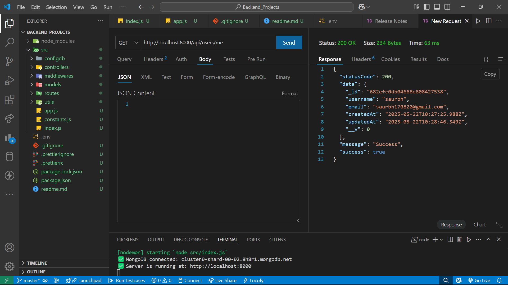
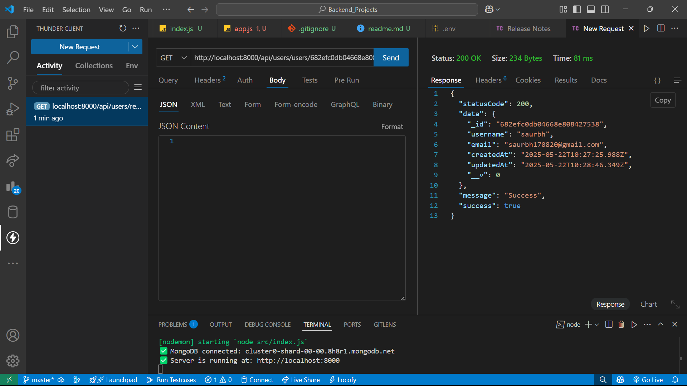
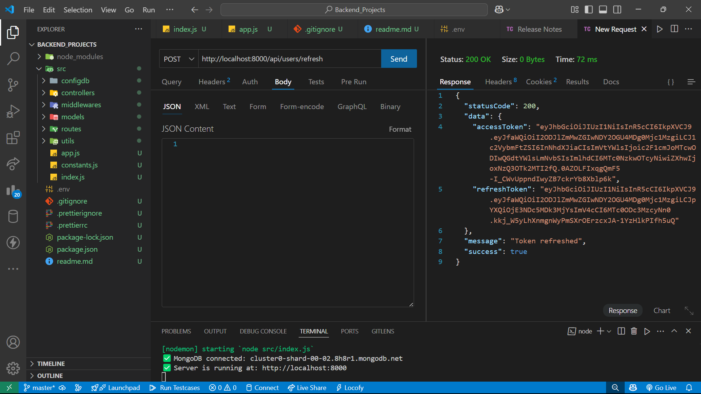
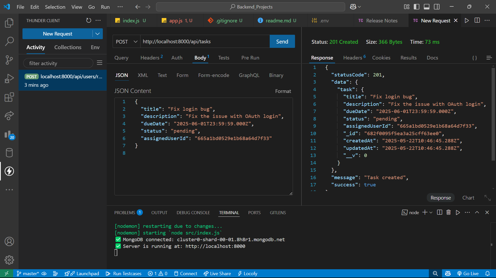
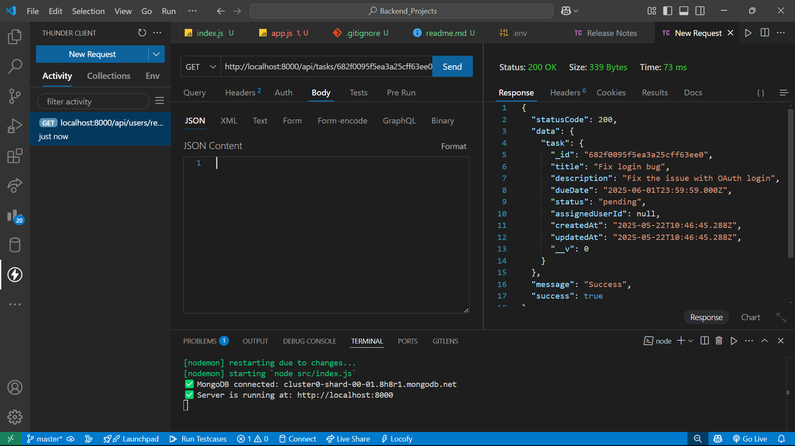
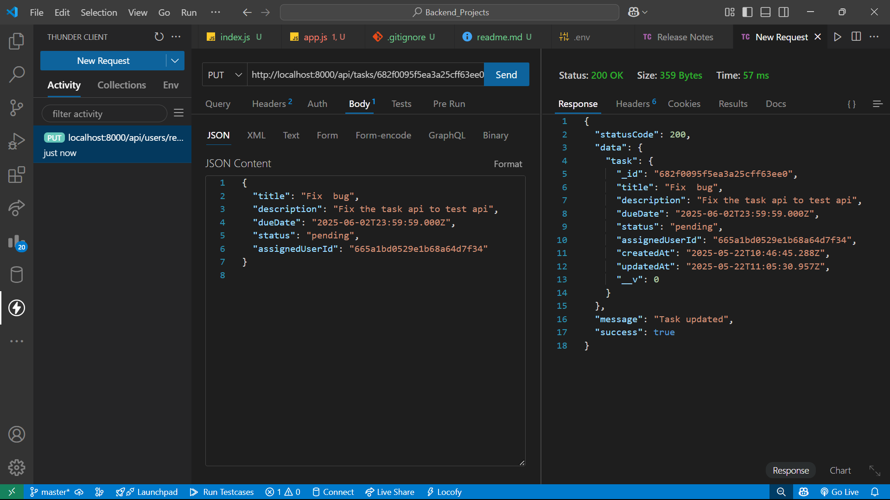
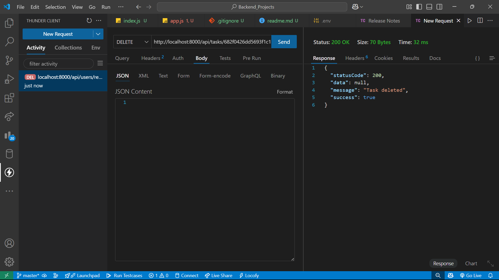

# Backend_assignment

A RESTful Task Management API built with Node.js, Express, and MongoDB featuring user and task management with JWT-based authentication. Now supports Docker containerization for easier deployment.

---

## Table of Contents

<<<<<<< HEAD
* [Project Overview](#project-overview)
* [Setup Instructions](#setup-instructions)
=======
- [Project Overview](#project-overview)  
- [Setup Instructions](#setup-instructions)  
- [Environment Variables](#environment-variables)  
- [API Documentation](#api-documentation)  
  - [User API Endpoints](#user-api-endpoints)  
  - [Task API Endpoints](#task-api-endpoints)
  - [API Response Format](#api-response-format)
  - [Standard Https Status Code used](#standard-https-status-code-used)
- [Git Version Control](#git-version-control)  
- [Bonus Features Implemented](#bonus-features-implemented)
>>>>>>> ec54651f5d67496dbe2fb713e38760e758612d72

  * [Local Setup](#local-setup)
  * [Docker Setup](#docker-setup)
* [Environment Variables](#environment-variables)
* [API Documentation](#api-documentation)

  * [User API Endpoints](#user-api-endpoints)
  * [Task API Endpoints](#task-api-endpoints)
* [Error Handling](#error-handling)
* [Version Control](#version-control)
* [Bonus Features](#bonus-features)

---

## Project Overview

It is a simple yet robust backend API that allows you to manage users and tasks similar to basic features of Trello or Todoist. It supports JWT authentication for secure access. Now with Docker support for seamless containerized deployment.

---

## Setup Instructions

### 🛠️ Local Setup

<details>
<summary>Click to expand</summary>

#### Key Dependencies

This project uses the following main Node.js packages:

* **express** – Web framework
* **mongoose** – MongoDB ODM
* **jsonwebtoken** – JWT-based authentication
* **bcrypt** – Password hashing
* **dotenv** – Environment variable management
* **cookie-parser** – Cookie support
* **cors** – Enable cross-origin requests
* **nodemon** (dev) – Auto-restart server during development

To install all dependencies:

```bash
npm install
```

#### Local Installation

1. **Clone the repository**

```bash
git clone https://github.com/gauravai2025/Backend_assignment.git
cd Backend_assignment
```

2. **Create `.env` file**

```env
PORT=8000
MONGODB_URI=mongodb+srv://<username>:<password>@<cluster-url>/<database>?retryWrites=true&w=majority
JWT_SECRET=your_jwt_secret_key
ACCESS_TOKEN_EXPIRY=15m
REFRESH_TOKEN_EXPIRY=7d
```

3. **Run the server**

```bash
npm start
```

Server will run at `http://localhost:8000`

</details>

---

### 🐳 Docker Setup

This project supports Docker-based deployment for better consistency across environments.

#### 1. Create a `.env` file

Same as in local setup, but use the Docker-compatible Mongo URI:

```env
PORT=8000
MONGODB_URI=mongodb://mongo:27017/tasksdb
JWT_SECRET=your_jwt_secret_key
ACCESS_TOKEN_EXPIRY=15m
REFRESH_TOKEN_EXPIRY=7d
```

#### 2. Build and Run with Docker Compose

```bash
docker-compose up --build
```

This will:

* Build the backend service container
* Spin up a MongoDB container
* Expose the app on `http://localhost:8000`

#### 3. Docker File Overview

##### Dockerfile

```dockerfile
FROM node:18

WORKDIR /app

COPY package*.json ./
RUN npm install

COPY . .

EXPOSE 8000

CMD ["npm", "start"]
```

##### docker-compose.yml

```yaml
version: '3'
services:
  app:
    build: .
    ports:
      - "8000:8000"
    environment:
      - MONGODB_URI=mongodb://mongo:27017/tasksdb
      - JWT_SECRET=your_jwt_secret_key
      - ACCESS_TOKEN_EXPIRY=15m
      - REFRESH_TOKEN_EXPIRY=7d
    depends_on:
      - mongo

  mongo:
    image: mongo
    ports:
      - "27017:27017"
```

---

## Environment Variables

| Variable               | Description                      | Example                       |
| ---------------------- | -------------------------------- | ----------------------------- |
| `PORT`                 | Port number to run the server    | 8000                          |
| `MONGODB_URI`          | MongoDB connection string        | mongodb://mongo:27017/tasksdb |
| `JWT_SECRET`           | Secret key for JWT token signing | your\_secret\_key\_here       |
| `ACCESS_TOKEN_EXPIRY`  | Access token expiration time     | 15m                           |
| `REFRESH_TOKEN_EXPIRY` | Refresh token expiration time    | 7d                            |


### User API Endpoints

| Method | Endpoint               | Description                  | Request Body                                                                                     | Authentication |
|--------|------------------------|------------------------------|---------------------------------------------------------------------------------------------------|----------------|
| POST   | `/api/users/register`  | Register new user            | `{ "name": "gaurav kumar", "email": "gaurav170820@gmail.com", "password": "pass123" }`           | No             |
| POST   | `/api/users/login`     | Login user (get tokens)      | `{ "email": "gaurav170820@gmail.com", "password": "pass123" }`                                   | No             |
| POST   | `/api/users/logout`    | Logout user                  | Not required                                                                                      | No             |
| POST   | `/api/users/refresh`   | Refresh access token         | Not required (uses refresh token from cookies)                                                    | Yes (JWT)      |
| GET    | `/api/users/users/:id` | Get user details             | Not required                                                                                      | Yes (JWT)      |
| GET    | `/api/users/users`     | List all users               | Not required                                                                                      | Yes (JWT)      |
| GET    | `/api/users/me`        | Get current user profile     | Not required                                                                                      | Yes (JWT)      |


### Task API Endpoints


| Method | Endpoint            | Description                                                                                     | Request Body                                                                                                                      |
|--------|---------------------|-------------------------------------------------------------------------------------------------|-----------------------------------------------------------------------------------------------------------------------------------|
| POST   | `/api/tasks`        | Create new task                                                                                 | `{ "title": "Task 1", "description": "Details", "dueDate": "2025-06-01", "status": "pending", "assignedTo": "userId" }`          |
| GET    | `/api/tasks/:id`    | Get task details                                                                                | N/A                                                                                                                               |
| GET    | `/api/tasks`        | List tasks (e.g., `?status=pending&assignedTo=userId&page=1&limit=10`)                          | N/A                                                                                                                               |
| PUT    | `/api/tasks/:id`    | Update task                                                                                     | `{ "title": "Updated", "status": "completed" }`                                                                                   |
| DELETE | `/api/tasks/:id`    | Delete task                                                                                     | N/A                                                                                                                               |


---
## API Test Endpoints (Screenshots)
| Method | Endpoint              | Description              | Screenshot |
|--------|-----------------------|--------------------------|------------|
| POST   | `/api/users/register` | User registration        |  |
| POST   | `/api/users/login`    | User login (JWT)         |  |
| GET    | `/api/users/me`       | Get current user profile |  |
| GET    | `/api/users/users/:id`| Get user details         |  |
| POST   | `/api/users/refresh`  | Refresh access token     |  |
| GET    | `/api/users/users`    | Get all users            |  |
| POST   | `/api/tasks`          | Create new task          |  |
| GET    | `/api/tasks/:id`      | Get task by ID           |  |
| GET    | `/api/tasks`          | Get all tasks            |  |
| PUT    | `/api/tasks/:id`      | Update task              |  |
| DELETE | `/api/tasks/:id`      | Delete task              |  |

## API Response Format

<<<<<<< HEAD
=======
#### All API responses (success or error) follow a standard structure for consistency

### Success Response Format

>>>>>>> ec54651f5d67496dbe2fb713e38760e758612d72
```
 constructor(statusCode, data, message = "Success") {
        this.statusCode = statusCode;
        this.data = data;
        this.message = message;
        this.success = statusCode < 400;
    }
```
### Error Response Format

```
constructor(
        statusCode,
         message = "Something went wrong",
          errors = [], 
          stack = ""
        ) {
        super(message);
        this.statusCode = statusCode;
        this.data = null;
        this.message = message;
        this.success = false;
        this.errors = errors;

        if (stack) {
            this.stack = stack;
        }
         else {
            Error.captureStackTrace(this, this.constructor);
        }
    }

```
## Standard Https Status Code used
| Code | Scenario                                                                 |
|------|--------------------------------------------------------------------------|
| 200  | OK – The request was successful and the server returned the expected response |
| 201  | Created – The request was successful and a new resource was created      |
| 400  | Bad Request – Invalid request body or missing required fields            |
| 401  | Unauthorized – Missing or invalid JWT token                              |
| 403  | Forbidden – User does not have permission to access the resource         |
| 404  | Not Found – The requested resource was not found                         |
| 500  | Internal Server Error – A generic server-side error occurred             |


<<<<<<< HEAD

## Version Control

*(resolved conflict and kept structure)*
=======

## Git Version Control
>>>>>>> ec54651f5d67496dbe2fb713e38760e758612d72

```bash
# Commit example
git commit -m "feat: add JWT authentication middleware"
git commit -m "fix: correct task status validation"
```

<<<<<<< HEAD
* `main` for production
* `develop` for staging
* Feature branches: `feature/auth`, `feature/tasks`, etc.

Repository: [Backend Assignment](https://github.com/gauravai2025/Backend_assignment)
=======
Repository: [Backend Assignment](https://github.com/gauravai2025/Backend_assignment)
=======
* The project uses Git for version control.
* Commits follow meaningful, clear messages.
>>>>>>> ec54651f5d67496dbe2fb713e38760e758612d72

---

## Bonus Features Implemented

✅ JWT Authentication with access/refresh tokens
✅ Comprehensive error handling
✅ API documentation with examples
✅ Pagination and filtering
✅ Environment configuration
✅ Docker containerization support 🐳
✅ Automated testing (Postman/thunder client)
